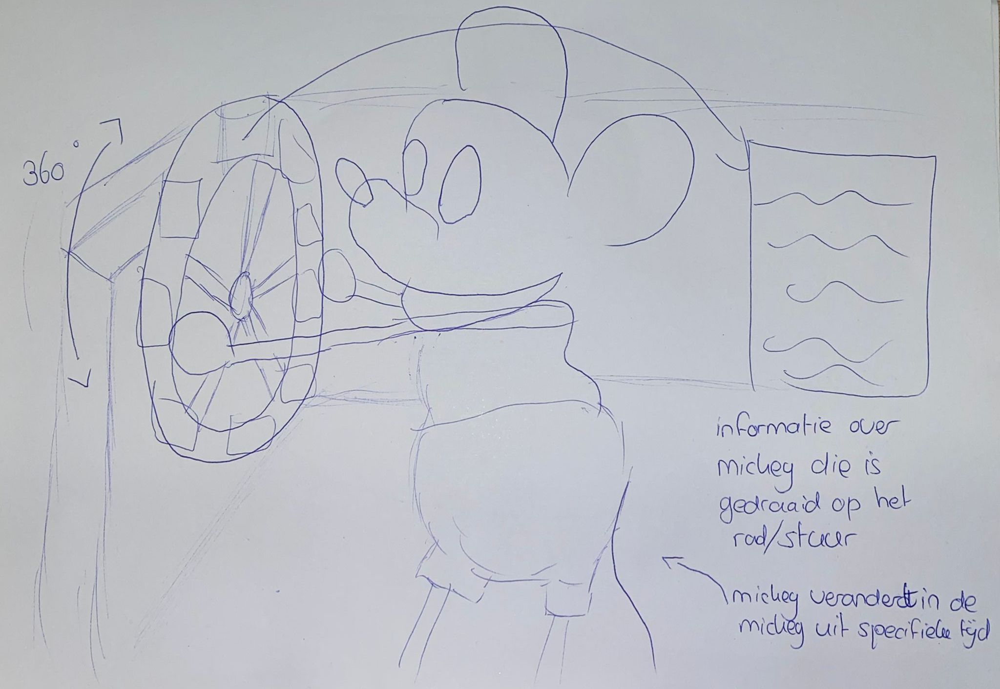

# Procesverslag
Markdown is een simpele manier om HTML te schrijven.  
Markdown cheat cheet: [Hulp bij het schrijven van Markdown](https://github.com/adam-p/markdown-here/wiki/Markdown-Cheatsheet).

Nb. De standaardstructuur en de spartaanse opmaak van de README.md zijn helemaal prima. Het gaat om de inhoud van je procesverslag. Besteedt de tijd voor pracht en praal aan je website.

Nb. Door *open* toe te voegen aan een *details* element kun je deze standaard open zetten. Fijn om dat steeds voor de relevante stuk(ken) te doen.

## Jij

### Ontwerper:
Jorinda Waitz

#### Je startniveau:
Mijn startniveau is: blauw
In 2018/2019 heb ik een jaar de opleiding CMD gevolgd. Ik heb toen html, css en javascript geleerd, maar ik had daar heel veel moeite mee. Ook is alles na drie jaar een beetje weggezakt, dus ik moet mijn geheugen weer opfrissen. 

# Je plan

  
De eerste versie/schets van je ontwerp & je persoonlijke uitdaging

  ### De eerste versie/schets:
  
  
  
  
Mijn plan is om de verschillende Mickey’s door de jaren heen te laten zien. Ik ging eerst wat deskresearch doen over de verschillende Mickey’s en kwam bij Steamboat Willie uit. Die Mickey staat bekend als de eerste Mickey en de dag dat de Steamboat Willie gelanceerd werd, wordt gezien als de verjaardag van Mickey.
  
Ik wil dus Mickey op chronologische volgorde laten zien en daarom leek het mij een goed begin om Steamboat Willie als eerst te laten zien en dat iconische beeld als achtergrond te gebruiken.
  
Het idee is om alle Mickey’s op het stuurwiel af te beelden en het wiel te laten draaien. De Mickey die wordt aangewezen als het wiel is gedraaid, wordt vervangen door de Mickey die al staat afgebeeld. Ook veranderd de bijpassende informatie wat bij elke Mickey hoort. 

Dit idee is voor mij een uitdaging. Ik weet namelijk niet zo goed hoe ik dit moet gaan maken. Ik weet wel dat ik javascript nodig heb voor dit idee, maar daar moet ik mij dan eerst weer in gaan verdiepen.

  ### Je ambitie: 
  Aan deze technieken/punten wil ik werken:
  
 -Ik wil de basis van HTML, CSS en Javascript weer begrijpen.
  
-Ik wil mijn ideeën kunnen realiseren, of zo dicht mogelijk tot het originele idee komen.
  
-Ik wil leren om een afbeelding/object te animeren.

 

## Voortgang/Feedback 1 (concept)

  
Mijn bevindingen + wijzigingen 

   
  
  ### Bevinding 1: 
  Het stuurwiel zie je nu via een zijaanzicht. Daardoor zie je de Mickey’s niet goed.
  
  #### oplossing: 
  Ik wil dit gaan oplossen door het stuurwiel van voor te laten afbeelden.

  ### Bevinding 2:
In plaats van gelijk alle Mickey’s te laten zien op het stuurwiel, kan ik ook de jaartallen laten zien. Hierdoor heb je meer progressive disclosure. 
  
  #### oplossing:
Ik wil deze feedback gaan toepassen in mijn nieuwe ontwerp. 

  ### Bevinding 3:
Voor meer interactie kan ik de staart van Mickey laten bewegen.
  
  #### oplossing:
Ik ga gebruik maken van afbeeldingen van Mickey, de staart kan ik dus niet los bewegen. Ik wil in plaats van de staart de hele afbeelding laten bewegen.
  
  ### Bevinding 4:
De informatie tekst kan op een leukere manier worden weergegeven.
  
  #### oplossing:
Ik heb Steamboat Willie gekeken om inspiratie op te doen. Ik zag daar een schatkist, wat mij op een idee bracht. Ik wil een schatkist open laten gaan en daar de informatie uit laten komen.

## Voortgang/Feedback 2 (concept+code)

  
Mijn bevindingen + wijzigingen

  
  
  
  ### Bevinding 1:
De teksten hebben niet voldoende contrast.
  
  #### oplossing:
Ik heb de achtergrond kleur van het informatie vak veranderd en niet meer transparant gemaakt. Nu is de tekst goed leesbaar.

  ### Bevinding 2:
Het stuurwiel kan niet gedraaid worden met het toetsenbord (tab).
  
  #### oplossing:
Ik heb met Javascript ervoor gezorgd dat je met spatie en enter het stuurwiel kan laten draaien. Tab werkt alleen niet, want mijn laptop selecteert dan de website link.

  ### Bevinding 3:
  Als je over het stuurwiel hovert, veranderd de muis niet.
  
  #### oplossing:
  Ik heb aan de button een cursor:pointer toegevoegd.
  
  
  ### Bevinding 4:
  De headings kunnen beter gebruikt worden. “Click to spin the wheel” is nu een < p >, maar kan beter een < h2 >
  
  #### oplossing:
  Ik heb alle “titels” veranderd naar h1/2/3 en alleen de tekst een 
 gegeven.
  
  
  ### Bevinding 5:
  Er is geen gebruik gemaakt van een button.
  
  #### oplossing:
  Ik heb de afbeelding in een button gezet.
  
  
  ### Bevinding 6:
  Meer witruimte in de code gebruiken.
  
  #### oplossing:
  Ik heb gebruik gemaakt van meer enters gebruikt en duidelijker met commentaar aangegeven wat waar begint.
  
  
  ### Bevinding 7:
 Meer structuur aanbrengen in CSS.
  
  #### oplossing:
  De volgorde van mijn HTML-code aanhouden voor mijn CSS.
  
  
  ### Bevinding 8:
  Veel gebruik gemaakt van ID’s, kan beter. Bijvoorbeeld: header p.
  
  #### oplossing:
  Ik heb alle ID’s vervangen.
  
 
  ### Bevinding 9:
 CSS custom properties toevoegen.
  
  

## Voortgang/Feedback 3 (concept+code)

  
Mijn bevindingen + wijzigingen

  

  
  ### Bevinding 1:
Het informatievlak ziet er een beetje saai uit.

  #### oplossing:
Ik heb een box-shadow toegevoegd.

  ### Bevinding 2:
Mickey zou ook moeten bewegen.
  
  #### oplossing:
Ik heb Mickey nu laten springen als hij getoond wordt.

  
  ### Bevinding 3:
 Je kan heel vaak op het wiel klikken, waardoor alles een beetje vast loopt en alle Mickey’s heel snel achter elkaar getoond worden.
  
  #### oplossing:
True/false functie toegevoegd als mickey klaar is met draaien. Als de wiel niet klaar is met draaien, stopt de functie met verdergaan. Als je dus bijvoorbeeld 3x op het wiel klikt, krijg je nog maar 1 Mickey te zien. Als je wel klaar bent met draaien en op het wiel drukt, dan ga je beginnen met draaien en roep je de functie toonMickey op.
  
  ### Bevinding 4:
 Het zou mooier zijn als het stuurwiel een beetje gedraaid staat, goed in perspectief.
  
  #### oplossing:
  Ik wist niet hoe ik dit kon oplossen. Ik heb geprobeerd om transform: rotatey (50deg) toe te voegen aan de afbeelding, maar dat zag er lelijk uit. De afbeelding zou niet even groot moeten zijn, maar een deel zou "dunner" moeten zijn zodat je diepte creéert. 
  
  ### Bevinding 5:
  Disney font gebruiken.
  
  #### oplossing:
  Disney font gedownload en @font-face aangemaakt.

## Reflectie

  
Mijn eindresultaat & persoonlijke ontwikkeling

  ### Je uitkomst - karakteristiek screenshot(s):
  
  
  
  
  
  
  
  
Ik ben erg blij met het eindresultaat. Het komt aardig in de buurt van mijn oorspronkelijke idee, wat ik eerlijk gezegd niet had verwacht. 

  ### Dit ging goed/Heb ik geleerd: 
Ik heb geleerd hoe ik een animatie kan maken in CSS en die in Javascript kan laten oproepen. Ik had wel wat hulp nodig van anderen, maar op een gegeven moment had ik het zelf ook door en kon ik het ook op andere elementen toevoegen. 
 

  ### Dit was lastig/Is niet gelukt:
Ik vond het lastig om “nette” code te schrijven. Ik heb mijn code heel vaak moeten aanpassen, omdat ik als feedback kreeg dat het makkelijker kon. Ik gaf bijvoorbeeld eerst alle Mickey’s een eigen ID, waardoor ik een hele lange lijst kreeg. Dit kon makkelijker en mooier door maar één mickey in HTML te zetten en met Javascript de src aan te passen. 
Mijn originele plan was om Mickey’s of jaartallen op het stuurwiel te plaatsen. Toen ik eenmaal begon met de code, kwam ik erachter dat ik het al lastig vond om alleen het stuurwiel te laten draaien. Om nog jaartallen op het stuurwiel toe te voegen was voor mij echt te ingewikkeld. Als ik meer tijd had gehad, zou ik dat misschien nog hebben geprobeerd. Ik had dus besloten om niks op het stuur te plaatsen, maar het leek mij wel leuk als het stuur een beetje te draaien, zodat het in perspectief zou staan. Dit is mij alleen niet gelukt, zoals op de afbeelding hieronder te zien is. Ik heb daarom in mijn definitieve versie (zie hierboven) het stuur wel recht staan.

  
  

## Bronnenlijst

continu bijhouden terwijl je werkt

1. https://stackoverflow.com/questions/24386354/execute-js-code-after-pressing-the-spacebar
2. https://www.google.com/url?sa=i&url=https%3A%2F%2Fcommons.wikimedia.org%2Fwiki%2FFile%3ASteering_wheel_ship_1.png&psig=AOvVaw1EZP5vgyic29Kwz55C-s0E&ust=1650701788588000&source=images&cd=vfe&ved=0CAwQjRxqFwoTCPD238Cdp_cCFQAAAAAdAAAAABAD
3. https://www.google.com/url?sa=i&url=https%3A%2F%2Fwww.deviantart.com%2Ftag%2Fmickeymousecartoons&psig=AOvVaw2cjL73P3BsVPkSCmotIJhD&ust=1650713949040000&source=images&cd=vfe&ved=0CAwQjRxqFwoTCKDZp-bKp_cCFQAAAAAdAAAAABAJ
4. https://www.google.com/url?sa=i&url=https%3A%2F%2Fwww.youtube.com%2Fwatch%3Fv%3D35uX9CbDtxc&psig=AOvVaw1S9oc9M_G-pnzg5eonoKFY&ust=1651050032925000&source=images&cd=vfe&ved=0CAwQjRxqFwoTCKiB1-yusfcCFQAAAAAdAAAAABAD
5. https://www.deviantart.com/qbatgirlq/art/Infographic-Mickey-Mouse-through-the-years-766332123

